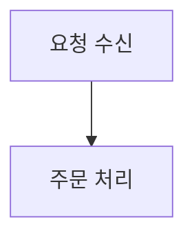
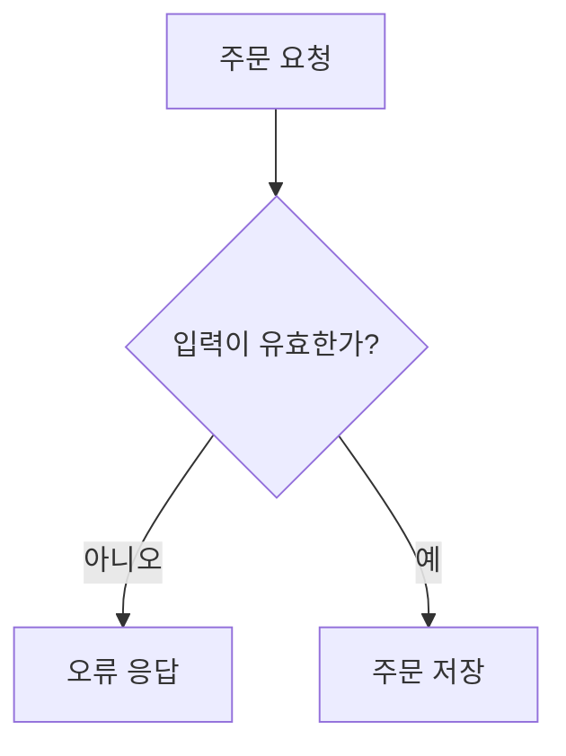

# Project Flow Viewer

프로젝트의 실행 조건·분기·결과를 Mermaid 다이어그램으로 탐색하는 로컬 웹 뷰어입니다. 언어, 프레임워크, AI 공급자를 제한하지 않습니다.

이 저장소는 역할을 분리합니다.

- `prompts/generate-diagrams.md`: 어떤 AI에서도 사용할 수 있는 흐름도 생성 명세
- `skills/project-flow-diagrams/SKILL.md`: 스킬을 지원하는 에이전트용 선택 진입점
- `server.js`와 `public/`: 생성된 `diagrams.md`를 표시하는 AI 없는 로컬 뷰어

## 빠른 시작

### 이미 `diagrams.md`가 있는 경우

```bash
DIAGRAM_SOURCE=/path/to/project/diagrams.md node server.js
```

브라우저에서 [http://localhost:4747](http://localhost:4747)을 엽니다. Node.js 내장 모듈만 사용하므로 패키지 설치가 필요 없습니다.

### 프로젝트 소스에서 흐름도를 생성하는 경우

1. 사용할 AI가 프로젝트 소스를 읽을 수 있게 합니다.
2. `prompts/generate-diagrams.md`를 지침으로 제공합니다.
3. AI가 생성한 `diagrams.md`를 `DIAGRAM_SOURCE`로 지정합니다.
4. 뷰어를 실행합니다.

Codex·Claude처럼 `SKILL.md` 형식의 스킬을 지원하는 환경에서는 `skills/project-flow-diagrams`를 설치하거나 직접 지정할 수 있습니다. 스킬을 지원하지 않는 환경에서는 공통 프롬프트만 사용하면 됩니다.

AI 서비스에 소스를 제공할 때는 조직의 코드·개인정보·기밀정보 반출 정책을 먼저 확인하세요. 뷰어 자체는 AI나 외부 API를 호출하지 않습니다.

## 지원하는 프로젝트

생성 명세는 확장자를 제한하지 않습니다. 웹 앱, API 서버, CLI, 배치, 자동화 스크립트, 데이터 파이프라인 등 소스에서 실행 흐름을 확인할 수 있는 프로젝트를 대상으로 합니다.

뷰어는 소스 코드를 직접 분석하지 않습니다. 아래 형식의 Mermaid Markdown만 읽습니다.

````markdown
## 전체 구조



## src/orders/create-order.ts | 주문 생성


````

- 첫 Mermaid 섹션은 `## 전체 구조`
- 상세 제목은 `## <상대 경로> | <표시명>`
- 상대 경로의 바로 위 폴더명이 사이드바 그룹으로 자동 표시
- 전체 구조의 파일명 또는 표시명 노드를 클릭하면 상세 흐름으로 이동

## 프로젝트별 설정

기본 설정은 `public/viewer.config.js`이며 특정 프로젝트 정보가 없습니다. 개인 또는 조직 설정은 별도 JavaScript 파일로 만들고 환경 변수로 지정합니다.

```bash
VIEWER_CONFIG=/path/to/viewer.config.js \
DIAGRAM_SOURCE=/path/to/diagrams.md \
node server.js
```

저장소 루트에 `viewer.config.local.js`가 있으면 자동으로 사용하며 이 파일은 Git에서 제외됩니다. 설정 선택 순서는 다음과 같습니다.

1. `VIEWER_CONFIG` 환경 변수
2. 저장소 루트의 `viewer.config.local.js`
3. `public/viewer.config.js` 기본값

다이어그램 입력도 같은 원칙으로 분리됩니다.

1. `DIAGRAM_SOURCE` 환경 변수
2. 저장소 루트의 `diagrams.local.md`
3. 저장소의 범용 예제 `diagrams.md`

설정 예시:

```javascript
window.FLOW_VIEWER_CONFIG = {
  ui: {
    eyebrow: 'ORDER PLATFORM',
    title: '주문 플랫폼 흐름',
    overviewTitle: '주문 플랫폼 전체 흐름',
    overviewDescription: '요청 → 결제 → 배송',
    filterLabel: '서비스',
  },
  preferredGroups: ['api', 'workers'],
  filters: {
    items: {
      orders: {
        id: 'orders',
        name: '주문',
        color: '#2563eb',
        soft: '#dbeafe',
        featured: true,
        note: '외부 요청 진입점',
      },
    },
    aliases: [{ keys: ['order', '주문'], item: 'orders' }],
    fileMap: { 'create-order.ts': ['orders'] },
  },
};
```

필터 설정을 생략하면 관련 UI가 자동으로 숨겨지고 순수 Mermaid 뷰어로 작동합니다. `preferredGroups`에 없는 폴더도 다이어그램 경로에서 자동 발견되어 표시됩니다.

Mermaid는 `strict` 보안 수준으로 렌더링합니다. 전체 구조의 드릴다운 이벤트는 Mermaid 문서 안의 실행 지시가 아니라 뷰어 코드가 직접 연결합니다.

## 파일 구성

- `prompts/generate-diagrams.md`: AI 중립 생성 명세의 정본
- `.codex/prompts/generate-diagrams.md`: Codex 프로젝트 프롬프트 호환 진입점
- `skills/project-flow-diagrams/SKILL.md`: 선택적 에이전트 스킬
- `server.js`: 로컬 정적 파일 서버와 Markdown 파서
- `public/index.html`: 화면 구조와 로컬 Mermaid 번들 로드
- `public/app.js`: 탐색, 렌더링, 드릴다운, 선택 필터
- `public/viewer.config.js`: 개인정보나 조직 정보가 없는 기본 설정
- `DESIGN.md`: UI 토큰과 컴포넌트 계약

## 개발 검증

```bash
npm test
npm run check
```
