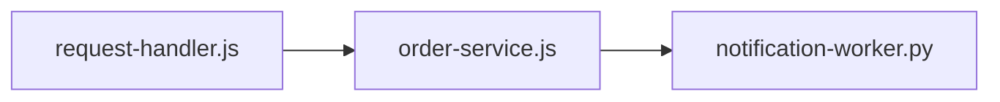
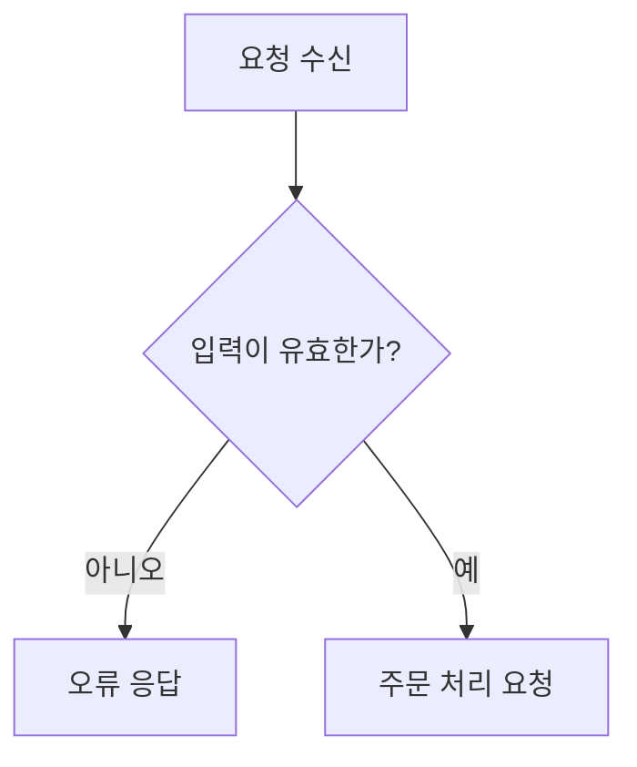
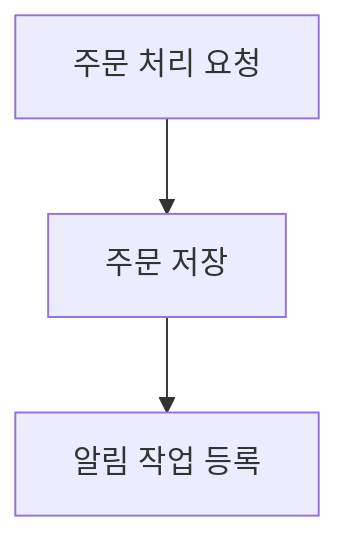
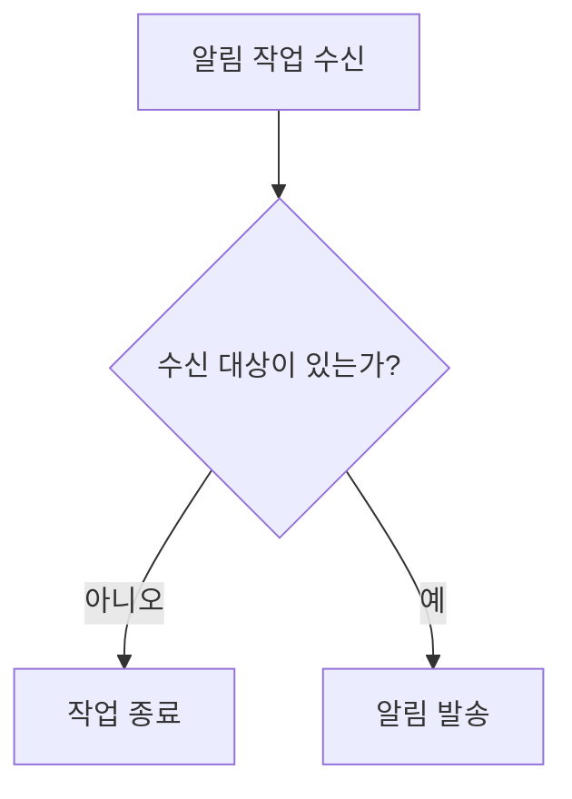

# Project Flow Viewer Example

## 전체 구조

```mermaid
flowchart LR
  A[request-handler.js] --> B[order-service.js]
  B --> C[notification-worker.py]
```

## src/http/request-handler.js | 요청 수신

```mermaid
flowchart TD
  A[요청 수신] --> B{입력이 유효한가?}
  B -- 아니오 --> C[오류 응답]
  B -- 예 --> D[주문 처리 요청]
```

## src/services/order-service.js | 주문 처리

```mermaid
flowchart TD
  A[주문 처리 요청] --> B[주문 저장]
  B --> C[알림 작업 등록]
```

## workers/notification-worker.py | 알림 발송

```mermaid
flowchart TD
  A[알림 작업 수신] --> B{수신 대상이 있는가?}
  B -- 아니오 --> C[작업 종료]
  B -- 예 --> D[알림 발송]
```
