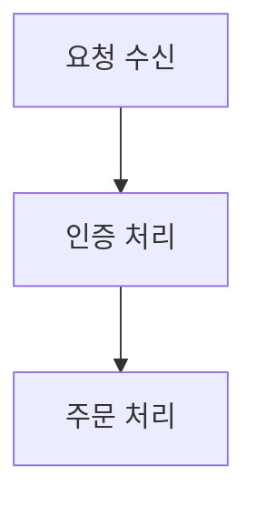
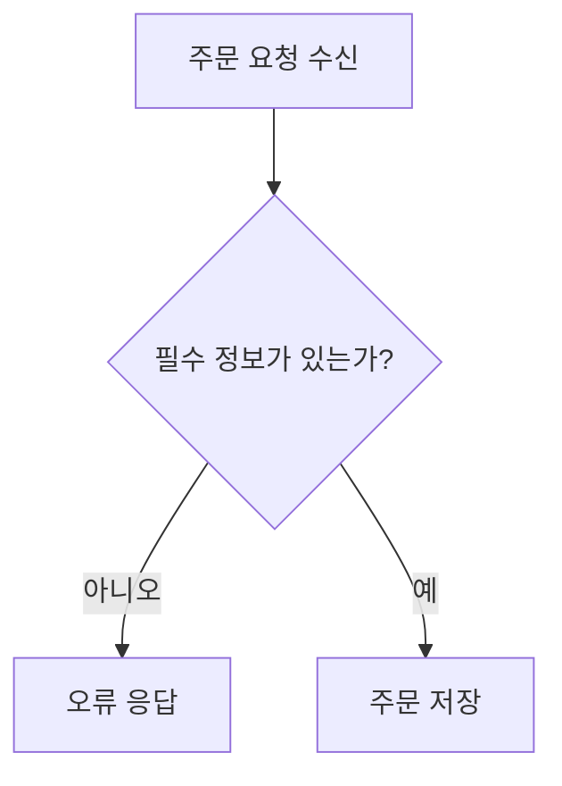

# Project Flow Viewer — 흐름도 생성 명세

현재 프로젝트의 소스와 설정을 읽고 `diagrams.md`에 Mermaid 흐름도를 생성하거나 갱신한다. 이 명세는 특정 AI, 언어, 프레임워크에 종속되지 않는다.

## 목표

코드를 모르는 사람도 다음 순서를 이해할 수 있게 작성한다.

> 언제 시작되고 → 무엇을 확인하고 → 어떤 경로로 나뉘며 → 무엇이 바뀌거나 출력되는가

함수 목록이나 파일 의존성만 나열하지 말고 실제 실행 흐름을 복원한다.

## 분석 범위

- 현재 작업 디렉터리를 대상 프로젝트로 본다. 사용자가 범위를 지정했다면 그 범위만 읽는다.
- 언어와 확장자를 미리 제한하지 않는다. 실행 진입점, 라우트, 이벤트, 작업 큐, 배치, 명령, UI 액션, 설정을 프로젝트 구조에 맞게 찾는다.
- 생성물, 의존성 캐시, 빌드 결과, 벤더 번들, 버전관리 내부 파일은 분석에서 제외한다.
- 외부 서비스 호출은 서비스명보다 업무 목적과 결과를 우선 표시한다.
- secret 원문, 개인정보 원문, 토큰, credential은 다이어그램에 복사하지 않는다.

## 작성 원칙

### 실제 조건과 결과를 표시한다

`조건 확인`, `데이터 처리`, `API 호출`처럼 의미를 숨기지 않는다. 코드에서 확인되는 비교값과 결과를 업무 언어로 풀어 쓴다.

```text
주문 상태가 "결제 완료"인가?
  ├─ 아니오 → 처리하지 않음
  └─ 예 → 배송 요청 생성
```

코드에서 의미를 확인할 수 없으면 추측하지 않고 `설정된 대상`, `설정된 완료 상태`처럼 표시한다.

### 함수 경계를 넘어 추적한다

진입 함수가 호출하는 판정·처리 함수와 참조 설정을 따라간다. 함수명과 변수명은 분석에 사용하되 최종 노드에는 사용자에게 필요한 경우만 노출한다.

### 중요한 분기와 실패 경로를 포함한다

- 실행 여부를 바꾸는 조건
- 성공·실패·재시도·중단 경로
- 데이터 생성·수정·전송 결과
- 사용자 알림과 외부 시스템 변경
- 중복 방지, 권한, 유효성 검사처럼 결과를 바꾸는 방어 로직

단순 구현 세부사항은 생략할 수 있다.

### 전체 구조와 상세 흐름을 연결한다

전체 구조에는 주요 모듈이나 업무를 표시한다. 상세로 이동할 노드 라벨은 상세 섹션의 파일명 또는 표시명과 정확히 일치시킨다.

## 출력 형식

첫 섹션은 전체 구조다.

````markdown
## 전체 구조


````

이후에는 파일 또는 독립된 구성 요소마다 상세 섹션을 만든다. 확장자는 제한하지 않는다.

````markdown
## src/orders/create-order.ts | 주문 생성


````

규칙:

- 제목 형식: `## <상대 경로> | <사람이 이해할 표시명>`
- 각 섹션에는 Mermaid 코드블록을 정확히 하나 둔다.
- 첫 섹션은 반드시 `## 전체 구조`로 시작한다.
- 경로의 바로 위 폴더명이 뷰어의 사이드바 그룹이 된다.
- 동일 파일명이 여러 경로에 있어도 경로별 섹션을 유지한다.
- 기존 `diagrams.md`를 갱신할 때 분석 대상 밖의 유효한 섹션은 보존한다.

## 완료 검증

- `## 전체 구조`가 첫 Mermaid 섹션인지 확인한다.
- 모든 상세 섹션이 `경로 | 표시명` 형식인지 확인한다.
- Mermaid 코드블록이 닫혔는지 확인한다.
- 전체 구조의 드릴다운 대상이 실제 상세 섹션과 연결되는지 확인한다.
- 비밀값이나 개인정보 원문이 결과에 포함되지 않았는지 확인한다.
- 코드에서 확인할 수 없는 내용을 사실처럼 작성하지 않았는지 확인한다.

완료 후 생성·갱신한 섹션과 확인하지 못한 영역을 짧게 보고한다.
